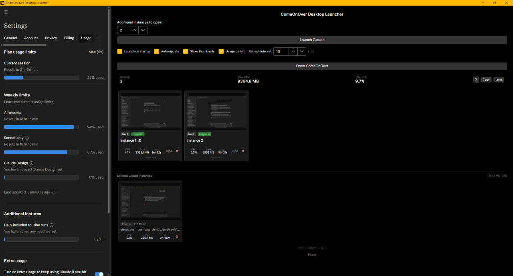

# ComeOnOver Desktop Launcher

Run multiple isolated Claude AI instances side by side on Windows. Each slot has its own login session, extensions, and MCP connections — switch between work, personal, and research contexts without losing state.



## Features

### Multiple isolated Claude slots
- Launch up to 100 Claude Desktop instances simultaneously (configurable)
- Each slot uses a dedicated user-data directory (`ClaudeSlot1`, `ClaudeSlot2`, ...) — logins, cookies, extensions, and MCP connections are fully separate
- Name each slot (e.g. "Work", "Personal", "Research") — names persist between sessions
- Hide a slot to the system tray without terminating it (MCP connections stay alive); restore it with the Show button

### Live resource monitoring
- Per-slot CPU %, RAM, and uptime updated every poll tick
- RAM and CPU totals match Windows Task Manager — the full Electron process tree (renderer, GPU, crashpad, network service) is aggregated per slot
- Per-slot activity signal: "Active now" / "Active Xm ago" / "Idle" based on CPU threshold
- Combined totals row: running instance count, total RAM, total CPU

### Thumbnails & preview
- Live window thumbnails captured per slot on every poll tick
- Click any thumbnail to open a full-size lightbox preview
- Toggle thumbnails off via the "Show thumbnails" checkbox if you prefer a minimal view

### Embedded usage dashboard
- Claude's usage page (`claude.ai/settings/usage`) embedded inline as a resizable side panel
- Drag the splitter to resize; right-click the splitter or use the "Usage on left" checkbox to swap sides
- Auth persists across restarts — log in once

### Auto-update
- Updates download and install automatically in the background via [Velopack](https://velopack.io)
- "Restart to install" prompt appears when a new version is ready, on your schedule
- Opt-out toggle in the settings bar
- Apply-failure detection: if an update fails to apply (e.g. Defender file lock), a banner tells you instead of silently reverting

## Requirements

- Windows 10/11
- [Claude Desktop](https://claude.ai/download) installed via the Microsoft Store
- No .NET installation required — the installer bundles everything

## Install

Download the latest `ComeOnOverDesktopLauncher-win-Setup.exe` from [Releases](https://github.com/LewisIsWorking/ComeOnOverDesktopLauncher/releases) and run it.

The installer puts the launcher in `%LOCALAPPDATA%\ComeOnOverDesktopLauncher\` (no UAC prompt) and creates a Desktop shortcut and Start Menu entry.

**SmartScreen warning.** Because the installer isn't code-signed yet, Windows shows a "Windows protected your PC" dialog on first run. Click **More info → Run anyway**. This is a one-time prompt; subsequent auto-updates don't re-trigger it. Code signing is on the roadmap.

**Portable install.** Each release also ships `ComeOnOverDesktopLauncher-win-Portable.zip` — extract and run directly. The portable version does not auto-update.

**Upgrading from v1.9.x or earlier?** See [`docs/MIGRATION.md`](docs/MIGRATION.md) for a one-time migration from the old portable `.exe` to the installer-based distribution.

## Getting started (from source)

```
git clone https://github.com/LewisIsWorking/ComeOnOverDesktopLauncher
```

Open `ComeOnOverDesktopLauncher.sln` in Rider or Visual Studio, then build and run `ComeOnOverDesktopLauncher`.

## Project structure

```
ComeOnOverDesktopLauncher/          # Avalonia UI — views, view models, DI wiring
ComeOnOverDesktopLauncher.Core/     # Business logic — models, services, interfaces
ComeOnOverDesktopLauncher.Tests/    # xUnit test suite
```

## Tech stack

- .NET 10, Avalonia 12, CommunityToolkit.Mvvm
- Velopack for auto-update and installation
- WMI for process tree scanning
- Win32 P/Invoke for window hide/show, thumbnail capture, icon cache refresh

## Development notes

See [`docs/dev/LEARNINGS.md`](docs/dev/LEARNINGS.md) for the accumulated architectural invariants, hard rules, release checklist, and gotchas for this codebase. Written to be useful to any contributor (human or LLM).

- 200-line file limit on all source files — extract via OOP rather than trimming
- 100% test pass rate required before every push (enforced by a pre-push git hook)
- SOLID / MVVM / event-driven throughout; ViewModels never touch system APIs directly

## Roadmap

See [ROADMAP.md](ROADMAP.md).
