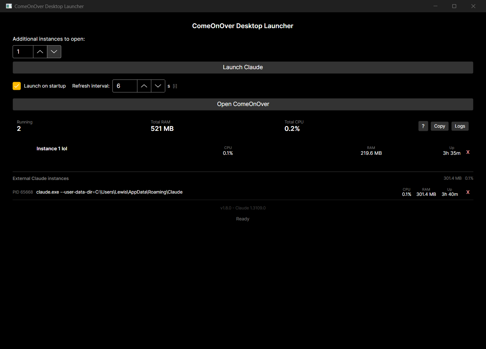
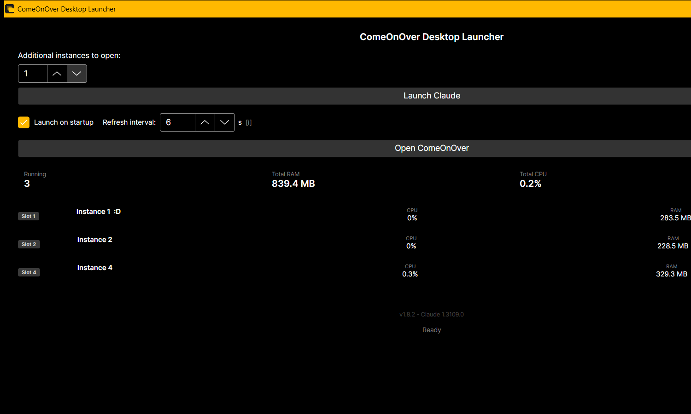
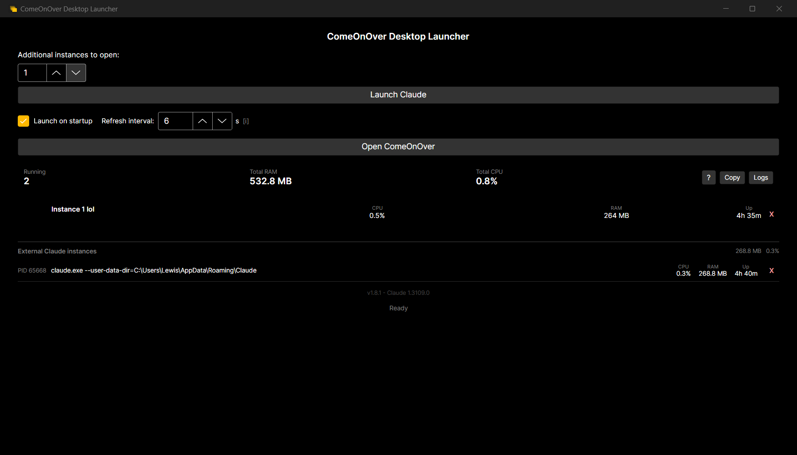

# ComeOnOver Desktop Launcher - Roadmap

## v1.0 - Released
- [x] Launch one or more Claude Desktop instances simultaneously
- [x] Fixed named slots to preserve login sessions between launches
- [x] Open ComeOnOver web app (https://comeonover.netlify.app) from launcher
- [x] Settings persist between sessions (slot count)
- [x] Claude install auto-detection (MSIX/WindowsApps + PowerShell fallback)
- [x] Resizable window with sensible minimum size
- [x] Auto-update path cache on every launch (handles Claude updates silently)
- [x] GitHub Actions release pipeline - self-contained .exe and .zip, no .NET required

## v1.1 - Released
- [x] System tray icon - minimize to tray, right-click quick-launch menu
- [x] Close-to-tray - clicking X hides the window, use tray Quit to fully exit
- [x] Running instance count with refresh button
- [x] Fix: windowed process count (no longer inflated by Electron child processes)

## v1.2 - Released

- [x] Per-instance resource display: CPU %, RAM usage, process uptime
- [x] Combined totals: total CPU and RAM across all running Claude instances
- [x] Resource data auto-refreshes every 5 seconds
- [x] Manual refresh button
- [x] Slot naming - users can name each instance (e.g. "Work", "Personal")
- [x] Slot names persist to settings and survive app restarts
- [x] Fix: clicking outside slot name field correctly deselects it

## v1.3 - Released
- [x] Login persistence - slots seeded with cookies from default Claude profile on first use
- [x] Version number displayed in UI, auto-updates from csproj version property

## v1.4 - Released
- [x] Launch on Windows startup toggle in UI
- [x] App starts minimised to tray when launched on startup (--minimised flag)
- [x] Login status indicator per slot: filled circle (logged in) or empty circle (not yet seeded)
- [x] Better error messaging when Claude is not installed - includes download link hint
- [x] Registry abstraction (IRegistryService) for future cross-platform support
- [x] Zero build warnings - CA1416 platform annotations added throughout
- [x] .gitattributes added to normalise line endings

## v1.5 - Released
- [x] Configurable resource monitor refresh interval (1-60 seconds)
- [x] Notify user when a new launcher version is available on GitHub

## v1.6 - Released

### Diagnostic logging
- [x] File logging via `ILoggingService` / `FileLoggingService`
- [x] Rolling daily log files at `%APPDATA%\ComeOnOverDesktopLauncher\logs\launcher-yyyy-MM-dd.log`
- [x] Every stage of the launch flow is logged (path resolution, slot seeding, process start)
- [x] Thread-safe logging with I/O failures swallowed - logging can never crash the app
- [x] "Logs" button in resource-totals row opens the log folder in Explorer
- [x] `[CallerMemberName]` auto-tags every log line with the method that emitted it

### Launch semantics
- [x] `Launch Claude` button now opens the requested number of **additional** instances
- [x] New `ISlotManager.GetNextFreeSlots(count)` scans for the next unoccupied slot numbers
- [x] Slot occupation detected via commandline inspection (`--user-data-dir=...\ClaudeSlotN`) not process count
- [x] Default Claude profile no longer interferes with slot detection
- [x] Safety cap at slot 100 so malformed state can never hang the UI
- [x] Input label renamed from "Claude instances to open" to "Additional instances to open" for clarity

### Login persistence improvements
- [x] Cookies seeding uses `FileShare.ReadWrite` so it works while Claude is running
- [x] Copied cookies are verified against the SQLite 3 magic header; invalid copies are discarded
- [x] Slots opened while other Claude instances are running now inherit login correctly

### UI polish
- [x] Per-instance row layout now aligns with the combined-totals border above
- [x] CPU / RAM / Up columns are vertically under Total RAM / Total CPU columns
- [x] Close button column aligns with the "Logs" button column

## v1.7.1 - Released

- [x] **v1.7.1 fix** - always re-seed from cache on launch. v1.7.0's `IsSeeded` only checked Cookies size, so a slot with leftover Cookies from one session and a stale `Local State` from another would skip the cache, and Chromium could not decrypt with the mismatched key -> surprise login wall. Re-seeding is idempotent and cheap (~15 ms for three small files); `TrySeed` fails silently if the cache is empty or a destination is locked, so calling it on every launch is safe and corrects any drifted slot state. Also fixed four timing-flaky `SlotProcessMonitorTests` that broke v1.7.0's CI build on slow GitHub Actions runners (replaced fixed `Thread.Sleep` with polling-with-deadline).
- [x] **Start maximised** - launcher now opens maximised by default (`WindowState="Maximized"` on the main window) so running/logged-in instances and their resource stats are visible without manual resize.
- [x] **Seed cache** - persistent `%APPDATA%\ComeOnOverDesktopLauncher\seed\` snapshot of a known-good Claude login state (Cookies + Local State + Preferences)
- [x] New `ISlotSeedCache` / `FileSlotSeedCache` services capture and apply the snapshot atomically; failed captures leave the previous cache intact
- [x] SQLite magic-header + JSON `os_crypt.encrypted_key` validation rejects corrupt or half-written cache files
- [x] `SlotInitialiser` now seeds from the cache *first*, falling back to default-profile / other-slot Cookies only when the cache has never been populated
- [x] New slots opened while the default Claude profile is running now come up logged in (previously required closing Claude first)
- [x] New `ISlotProcessMonitor` / `SlotProcessMonitor` polls running Claude slots and raises `SlotClosed` events
- [x] Pure-function `SlotProcessTickRunner` extracted so transition logic is unit-testable without a real timer
- [x] `SlotSeedCacheUpdater` subscribes to `SlotClosed`, waits 5s for Electron helpers to release locks, then opportunistically refreshes the seed cache
- [x] 162 tests passing (up from 119), zero warnings, zero errors

## v1.8.0 - Released

- [x] **Show Claude Desktop version in UI** - read `FileVersionInfo.ProductVersion` from the resolved claude.exe and display it in the footer alongside the launcher version (e.g. `Launcher v1.7.1 - Claude 1.3109.0.0`). New `IClaudeVersionResolver` service + property on `MainWindowViewModel` + text in the footer region of `MainWindow.axaml`.
- [x] **Split UI for launcher-managed vs externally-launched Claude instances** - windowed claude.exe processes are now cleanly split into two lists: the slot list (top) for processes with `--user-data-dir=...\ClaudeSlotN`, and the External Claude instances section (bottom) for everything else (default-profile Claude launched from the Start menu, or Claude launched by some other tool). Each windowed Claude appears in exactly one list, never both.
    - Required a non-obvious WMI enrichment fix: Chromium/Electron's "browser main" process (the one with the visible window) reports an empty args list to WMI - its `--user-data-dir` flag is only copied into child processes during fork. `WmiClaudeProcessScanner` now queries `ParentProcessId` too, walks each windowed main's direct children, and when the main's own cmdline is missing the flag, extracts `--user-data-dir=...` from any child and appends it. Without this, every windowed Claude mis-classified as external.
    - Windowed-only filter via `Process.MainWindowHandle != IntPtr.Zero` suppresses the ~10 Electron child processes (renderer, GPU, crashpad, audio/video/network utility services) that would otherwise flood the UI.
    - Slot list now relabels `InstanceNumber` with the real slot number from the cmdline, not the sequential enumeration index. Slot 3 renders as "Instance 3" even when slots 1 and 2 are closed (the previous enumeration approach mis-labelled this case).
    - New `SlotInstanceListViewModel` (parallel to `ExternalInstanceListViewModel`) owns the filter + reconcile pipeline. Reconciliation is identity-preserving (same VM instance per slot number across refreshes), so row-level state like edit-in-progress name text survives.
    - Close button on external rows pops a custom destructive-severity `ConfirmDialog` (new `IConfirmDialogService` + `Views/ConfirmDialog.axaml`) with PID, uptime and full command line before calling `IProcessService.KillProcess`. User cancel is the default - Esc and the window close button both cancel.
- [x] **Launch sequencing owned by `ClaudeInstanceLauncher`** - new `LaunchInstances(int count)` method owns the full slot-pick + seed + launch sequence. `MainWindowViewModel` no longer depends on `ISlotManager` or `ISlotInitialiser`; it just calls `_launcher.LaunchInstances(SlotCount)`.
- [x] **`Copy window screenshot to clipboard` button** - shipped in v1.7.3 using Avalonia 12's `RenderTargetBitmap.Render(visual)` + `ClipboardExtensions.SetBitmapAsync` (not GDI) - rendering the visual tree directly gives reliable results regardless of window state (maximised, partially covered, off-screen) that the original GDI `CopyFromScreen` approach would have struggled with. Image lands on the clipboard in every relevant Windows format simultaneously (`image/png`, `PNG`, `DeviceIndependentBitmap`, `Format17`, `Bitmap`) so it pastes into Slack/Discord/Word/Paint without fuss.
- [x] 229 tests passing (up from 162 in v1.7.1), zero warnings, zero errors

## v1.8.2 - Released

This release is mostly invisible to end users - it's a structural cleanup release that eliminates technical debt and adds two new identity features. But the structural work unblocks faster feature delivery afterwards.

### New features
- [x] **"Slot N" identity pill** on every launcher-managed slot row. Previously the only identifier was the editable nickname (defaulting to "Instance N"), which conflated *identity* (which ClaudeSlotN data directory the instance uses) with *naming* (user-chosen label like "Work" or "Personal"). The pill now carries the identity explicitly and the nickname textbox becomes a proper free-text label. Slot number comes from the real `--user-data-dir=...\ClaudeSlotN` cmdline match so it's always accurate even when slots are opened out of order.
- [x] **Tray-resident slot detection and surfacing.** Slots that have been close-to-tray'd (window hidden, process tree still alive, still counting toward Total RAM) now appear in a new "Hidden / tray" section below the visible slot list. Before v1.8.2 these vanished from the launcher entirely because the scanner's windowed-only filter (`MainWindowHandle != 0`) suppressed them, leaving the user to hunt for them in the system tray icon stack.
    - New `ClaudeProcessInfo.IsWindowed` property on the core model.
    - New `SlotProcessInfo.IsTrayResident` propagated from `!IsWindowed` at classification time.
    - Scanner filter changed from "is windowed" to "is main process" (parent is not another claude.exe). This correctly includes tray-resident main processes while still excluding the ~10 Electron child processes per slot.
    - `SlotInstanceListViewModel` split into `Items` (visible) + `TrayItems` (tray-resident) collections; reconciliation runs on both in parallel. Slots transition cleanly between collections when close-to-tray'd or restored.
    - New `TrayInstanceList.axaml` UserControl renders the hidden section with read-only nickname (can't usefully edit the name of a slot you can't see) and a "Quit" button that force-kills the process tree (no confirm dialog - the slot has no visible window whose state could be lost).

### Structural cleanup
- [x] **Six files brought back under the 200-line limit.** The hard rule from the project's LEARNINGS.md is "≤200 lines per file, extract via OOP when a file grows past", but six files had drifted over during v1.7.x / v1.8.0 development and nobody (including Claude) noticed until an audit for this release.
    - `MainWindow.axaml` (301 lines) → split into 5 UserControls: `LaunchControlsPanel`, `ResourceTotalsRow`, `SlotInstanceList`, `TrayInstanceList` (new), `ExternalInstanceList`. MainWindow is now a 55-line thin composition of these controls. The Copy Screenshot button moved from an inline `Click=` handler in MainWindow to a `RoutedEvent` exposed by `ResourceTotalsRow` - the UserControl can't capture the parent window itself, so it raises `CopyClicked` and MainWindow's code-behind handles it (where the window reference is available).
    - `FileSlotSeedCache.cs` (219 lines) → validation helpers extracted into `SeedCacheValidators` (pure functions for SQLite-header check + Local State encrypted-key presence check). FSSC now at 188 lines and focused on IO orchestration.
    - Four oversized test files split into fixture + scenario-focused classes: `MainWindowViewModelTests` (208 → 3 files), `SlotInstanceListViewModelTests` (222 → fixture + filter + lifecycle + tray), `ExternalInstanceListViewModelTests` (242 → fixture + refresh + close), `SlotInitialiserTests` (219 → fixture + source ordering + fallback).

### CI guard against regression
- [x] **New `FileSizeLimitTests.NoCodeFileExceedsTwoHundredLines`** test enumerates every `.cs` and `.axaml` file in the solution and fails `dotnet test` if any exceeds 200 lines. The GitHub Actions release workflow runs `dotnet test`, so any future PR that reintroduces an oversized file will fail CI before it can merge. Prevents the silent debt accumulation we just cleaned up.

### Learnings followed from `docs/dev/LEARNINGS.md`
The NSubstitute-import gotcha (every new test file needs `using NSubstitute;` explicitly), the Avalonia compiled-XAML UserControl split pattern (`x:DataType` on the UserControl + `x:Name` not `Name=` + RoutedEvent pattern for code-behind handlers), and the `start_process` working-directory drift were all documented in LEARNINGS before this release. Still hit them during the refactor anyway - the new session-start rule is to read LEARNINGS first, always.

### Numbers
- 243 tests passing (up from 229 - +14 new: 6 `ClaudeProcessMainIdentifier`, 7 slot tray behaviour, 1 CI guard).
- 0 warnings, 0 errors.
- Every `.cs` / `.axaml` file now ≤ 200 lines.

## v1.8.1 - Released

- [x] **Custom app icon** - three diagonally-cascaded amber windows on a dark rounded-square backdrop, matching the launcher's own title-bar accent (#FFC107 on #1E1E1E) so the icon reads as "this app" when it sits next to the launcher window on the taskbar. The stacked-window glyph literally depicts what the launcher does (opens multiple Claude instances) and the silhouette survives aggressive downscaling to 32px without losing meaning.
    - **Source**: single authoritative `docs/design/appicon.svg` at 1024x1024. Opacity stack 0.35 / 0.62 / 1.0 gives depth without gradients (forbidden per the design rules and bad for small-size rendering anyway). Tiny title-bar dots inside each window sell the "windows not cards" reading at 64px+; they drop off at 16-32px where the cascade silhouette alone carries the semantic.
    - **Build pipeline**: `docs/design/build-icons.ps1` rasterises the SVG via ImageMagick (`winget install ImageMagick.ImageMagick`) into `appicon.ico` (nested 16/24/32/48/64/128/256), `appicon-256.png`, `appicon-64.png`, `appicon-32.png`. Idempotent, checked into repo, one-liner to re-run after any SVG tweak.
    - **Three hookup points**: `<ApplicationIcon>` in csproj (Explorer/Start menu/pinned shortcut exe icon), `<Window Icon="avares://.../appicon-256.png" />` in MainWindow.axaml (title-bar + running-taskbar), and `TrayIconService` (system tray icon while minimised). Generated binaries committed alongside the SVG so the release CI runner doesn't need ImageMagick.
    - **Cleanup**: default `Assets/avalonia-logo.ico` removed (no remaining references).

## v2.0 - ComeOnOver Integration
- [ ] Native ComeOnOver desktop app detection and launch (when available)
- [ ] Link to ComeOnOver download page if not installed
- [ ] ComeOnOver version display

## v3.0 - Cross-Platform
- [ ] macOS support (Claude Desktop path resolver)
- [ ] Linux support (Claude Desktop AppImage/deb path resolver)
- [ ] Platform-specific path resolver implementations behind IClaudePathResolver
- [ ] CI/CD pipeline for multi-platform builds

## Monetisation
- [ ] In-app advertising (tasteful, non-intrusive - planned for a future version)
- [ ] GitHub Sponsors / Ko-fi as an alternative for users who prefer ad-free
- [ ] Ads will never appear in v1.x - planned for a later major version once the user base is established

## Backlog / Under Consideration
- [ ] **Shared extension store across slots** — each `ClaudeSlot{N}\Claude Extensions\` is currently a separate copy of the extension tree, so installing a 2 GB extension like Desktop Commander N times burns N × 2 GB of disk and N × download time. CoODL could maintain a single shared `%LOCALAPPDATA%\ComeOnOverDesktopLauncher\extensions\{extension-id}\` store and, on slot initialisation, create junction points (symlinks) from each slot's `Claude Extensions\{extension-id}\` into the shared store. Claude would see a normal-looking folder; changes written via one slot would propagate to all. Risks: per-slot configuration divergence if an extension writes config into its own install dir (most don't — config typically lives in the slot's `claude_desktop_config.json`), and Claude might not handle the junction points gracefully on auto-update (need to test). Worth a spike-and-evaluate investigation.

- [ ] **Per-slot activity preview** — surface what each slot is doing at a glance so you don't have to alt-tab to remember. Open design questions before building:
    - **Thumbnail approach** (visual): periodically capture each slot's window via `PrintWindow`, downscale to 160x120, show under each row. Privacy win: no content parsing. Privacy loss: any text on the capture is readable if someone shoulder-surfs the launcher. Cost: ~20 ms per slot per capture, one capture every 30-60 s is plenty.
    - **Metadata approach** (textual): tail the latest message or active-tool indicator from Claude's local state store. Lower visual density but more useful at tiny sizes. Privacy concern much worse (the launcher would be reading conversation content), would need strict opt-in. Also depends on Claude's storage format being stable, which it isn't.
    - **Activity-signal approach** (minimal): show renderer CPU %, node-service CPU % (MCP activity), and last-interacted timestamp per slot. Zero content exposure, fast, survives Claude storage-format changes. Less "at a glance what is Slot 3 doing" but answers "is Slot 3 busy?" which is the common need.
    - Likely lands as a combo: activity signal always visible + optional thumbnail behind a settings toggle (off by default). Thumbnails stored in-memory only, never written to disk. Would want a "pause captures while on battery" option for laptop users.

- [ ] Auto-update mechanism for the launcher itself (Squirrel.Windows / Sparkle)
- [ ] Submit to awesome-avalonia list
- [ ] Reddit / HN launch post
