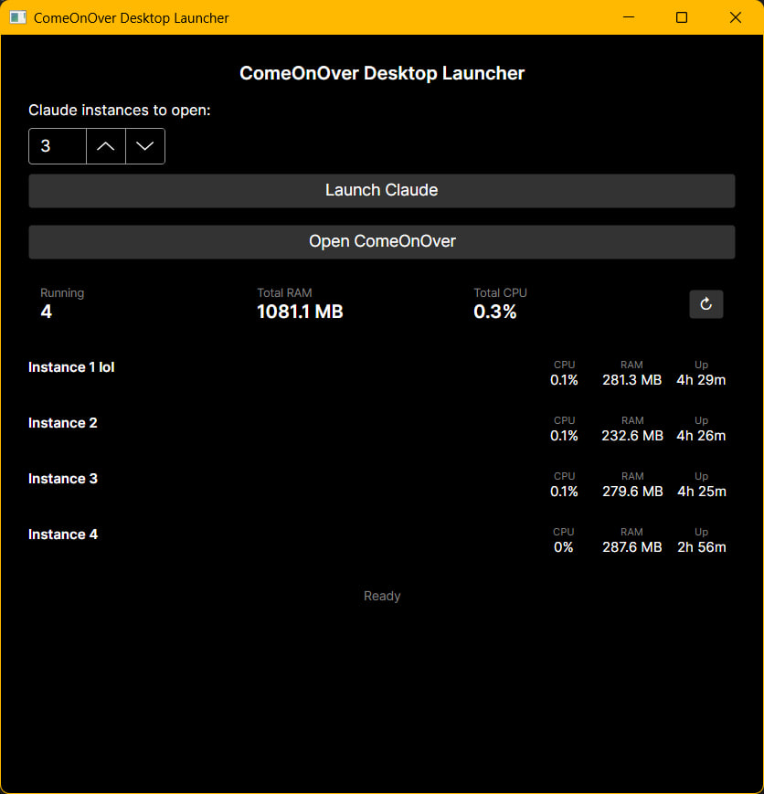
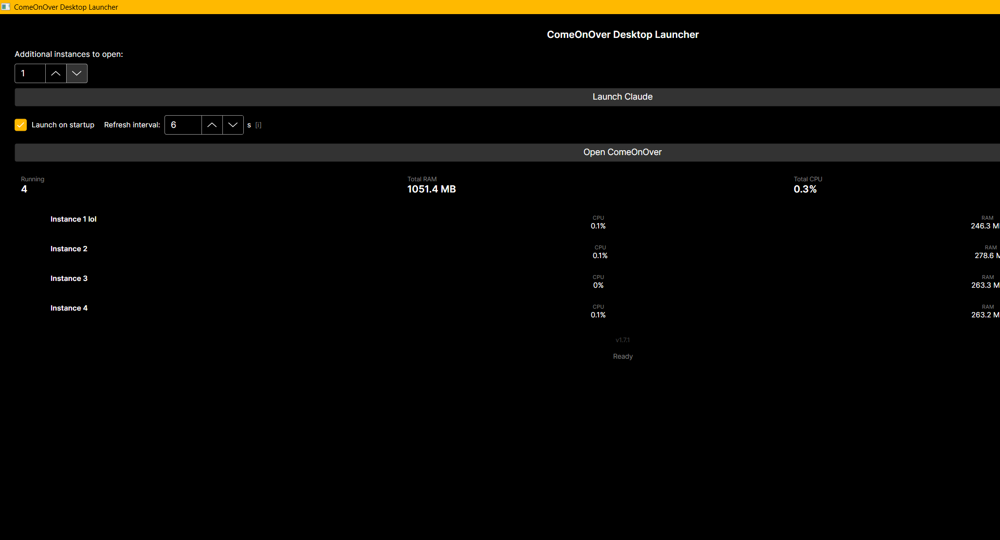

# ComeOnOver Desktop Launcher - Roadmap

## v1.0 - Released
- [x] Launch one or more Claude Desktop instances simultaneously
- [x] Fixed named slots to preserve login sessions between launches
- [x] Open ComeOnOver web app (https://comeonover.netlify.app) from launcher
- [x] Settings persist between sessions (slot count)
- [x] Claude install auto-detection (MSIX/WindowsApps + PowerShell fallback)
- [x] Resizable window with sensible minimum size
- [x] Auto-update path cache on every launch (handles Claude updates silently)
- [x] GitHub Actions release pipeline - self-contained .exe and .zip, no .NET required

## v1.1 - Released
- [x] System tray icon - minimize to tray, right-click quick-launch menu
- [x] Close-to-tray - clicking X hides the window, use tray Quit to fully exit
- [x] Running instance count with refresh button
- [x] Fix: windowed process count (no longer inflated by Electron child processes)

## v1.2 - Released

- [x] Per-instance resource display: CPU %, RAM usage, process uptime
- [x] Combined totals: total CPU and RAM across all running Claude instances
- [x] Resource data auto-refreshes every 5 seconds
- [x] Manual refresh button
- [x] Slot naming - users can name each instance (e.g. "Work", "Personal")
- [x] Slot names persist to settings and survive app restarts
- [x] Fix: clicking outside slot name field correctly deselects it

## v1.3 - Released
- [x] Login persistence - slots seeded with cookies from default Claude profile on first use
- [x] Version number displayed in UI, auto-updates from csproj version property

## v1.4 - Released
- [x] Launch on Windows startup toggle in UI
- [x] App starts minimised to tray when launched on startup (--minimised flag)
- [x] Login status indicator per slot: filled circle (logged in) or empty circle (not yet seeded)
- [x] Better error messaging when Claude is not installed - includes download link hint
- [x] Registry abstraction (IRegistryService) for future cross-platform support
- [x] Zero build warnings - CA1416 platform annotations added throughout
- [x] .gitattributes added to normalise line endings

## v1.5 - Released
- [x] Configurable resource monitor refresh interval (1-60 seconds)
- [x] Notify user when a new launcher version is available on GitHub

## v1.6 - Released

### Diagnostic logging
- [x] File logging via `ILoggingService` / `FileLoggingService`
- [x] Rolling daily log files at `%APPDATA%\ComeOnOverDesktopLauncher\logs\launcher-yyyy-MM-dd.log`
- [x] Every stage of the launch flow is logged (path resolution, slot seeding, process start)
- [x] Thread-safe logging with I/O failures swallowed - logging can never crash the app
- [x] "Logs" button in resource-totals row opens the log folder in Explorer
- [x] `[CallerMemberName]` auto-tags every log line with the method that emitted it

### Launch semantics
- [x] `Launch Claude` button now opens the requested number of **additional** instances
- [x] New `ISlotManager.GetNextFreeSlots(count)` scans for the next unoccupied slot numbers
- [x] Slot occupation detected via commandline inspection (`--user-data-dir=...\ClaudeSlotN`) not process count
- [x] Default Claude profile no longer interferes with slot detection
- [x] Safety cap at slot 100 so malformed state can never hang the UI
- [x] Input label renamed from "Claude instances to open" to "Additional instances to open" for clarity

### Login persistence improvements
- [x] Cookies seeding uses `FileShare.ReadWrite` so it works while Claude is running
- [x] Copied cookies are verified against the SQLite 3 magic header; invalid copies are discarded
- [x] Slots opened while other Claude instances are running now inherit login correctly

### UI polish
- [x] Per-instance row layout now aligns with the combined-totals border above
- [x] CPU / RAM / Up columns are vertically under Total RAM / Total CPU columns
- [x] Close button column aligns with the "Logs" button column

## v1.7.1 - Released

- [x] **v1.7.1 fix** - always re-seed from cache on launch. v1.7.0's `IsSeeded` only checked Cookies size, so a slot with leftover Cookies from one session and a stale `Local State` from another would skip the cache, and Chromium could not decrypt with the mismatched key -> surprise login wall. Re-seeding is idempotent and cheap (~15 ms for three small files); `TrySeed` fails silently if the cache is empty or a destination is locked, so calling it on every launch is safe and corrects any drifted slot state. Also fixed four timing-flaky `SlotProcessMonitorTests` that broke v1.7.0's CI build on slow GitHub Actions runners (replaced fixed `Thread.Sleep` with polling-with-deadline).
- [x] **Start maximised** - launcher now opens maximised by default (`WindowState="Maximized"` on the main window) so running/logged-in instances and their resource stats are visible without manual resize.
- [x] **Seed cache** - persistent `%APPDATA%\ComeOnOverDesktopLauncher\seed\` snapshot of a known-good Claude login state (Cookies + Local State + Preferences)
- [x] New `ISlotSeedCache` / `FileSlotSeedCache` services capture and apply the snapshot atomically; failed captures leave the previous cache intact
- [x] SQLite magic-header + JSON `os_crypt.encrypted_key` validation rejects corrupt or half-written cache files
- [x] `SlotInitialiser` now seeds from the cache *first*, falling back to default-profile / other-slot Cookies only when the cache has never been populated
- [x] New slots opened while the default Claude profile is running now come up logged in (previously required closing Claude first)
- [x] New `ISlotProcessMonitor` / `SlotProcessMonitor` polls running Claude slots and raises `SlotClosed` events
- [x] Pure-function `SlotProcessTickRunner` extracted so transition logic is unit-testable without a real timer
- [x] `SlotSeedCacheUpdater` subscribes to `SlotClosed`, waits 5s for Electron helpers to release locks, then opportunistically refreshes the seed cache
- [x] 162 tests passing (up from 119), zero warnings, zero errors

## v1.8 - Next
- [x] **Show Claude Desktop version in UI** - read `FileVersionInfo.ProductVersion` from the resolved claude.exe and display it in the footer alongside the launcher version (e.g. `Launcher v1.7.1 - Claude 1.3109.0.0`). New `IClaudeVersionResolver` service + property on `MainWindowViewModel` + text in the footer region of `MainWindow.axaml`.
- [ ] **Split UI for launcher-managed vs externally-launched Claude instances** - detect claude.exe processes with no `--user-data-dir=ClaudeSlot...` pattern and surface them as a separate row. Needs a design pass first: is `external` meant as (a) default-profile Claude from Start menu/taskbar, (b) slot-profile Claude launched before the launcher started, or (c) both? Kill semantics also need nailing down (we should not kill a process we did not start without clearer consent).
- [x] **`Copy window screenshot to clipboard` button** - shipped in v1.7.3 using Avalonia 12's `RenderTargetBitmap.Render(visual)` + `ClipboardExtensions.SetBitmapAsync` (not GDI) - rendering the visual tree directly gives reliable results regardless of window state (maximised, partially covered, off-screen) that the original GDI `CopyFromScreen` approach would have struggled with. Image lands on the clipboard in every relevant Windows format simultaneously (`image/png`, `PNG`, `DeviceIndependentBitmap`, `Format17`, `Bitmap`) so it pastes into Slack/Discord/Word/Paint without fuss.

## v2.0 - ComeOnOver Integration
- [ ] Native ComeOnOver desktop app detection and launch (when available)
- [ ] Link to ComeOnOver download page if not installed
- [ ] ComeOnOver version display

## v3.0 - Cross-Platform
- [ ] macOS support (Claude Desktop path resolver)
- [ ] Linux support (Claude Desktop AppImage/deb path resolver)
- [ ] Platform-specific path resolver implementations behind IClaudePathResolver
- [ ] CI/CD pipeline for multi-platform builds

## Monetisation
- [ ] In-app advertising (tasteful, non-intrusive - planned for a future version)
- [ ] GitHub Sponsors / Ko-fi as an alternative for users who prefer ad-free
- [ ] Ads will never appear in v1.x - planned for a later major version once the user base is established

## Backlog / Under Consideration
- [ ] Auto-update mechanism for the launcher itself (Squirrel.Windows / Sparkle)
- [ ] Submit to awesome-avalonia list
- [ ] Reddit / HN launch post
